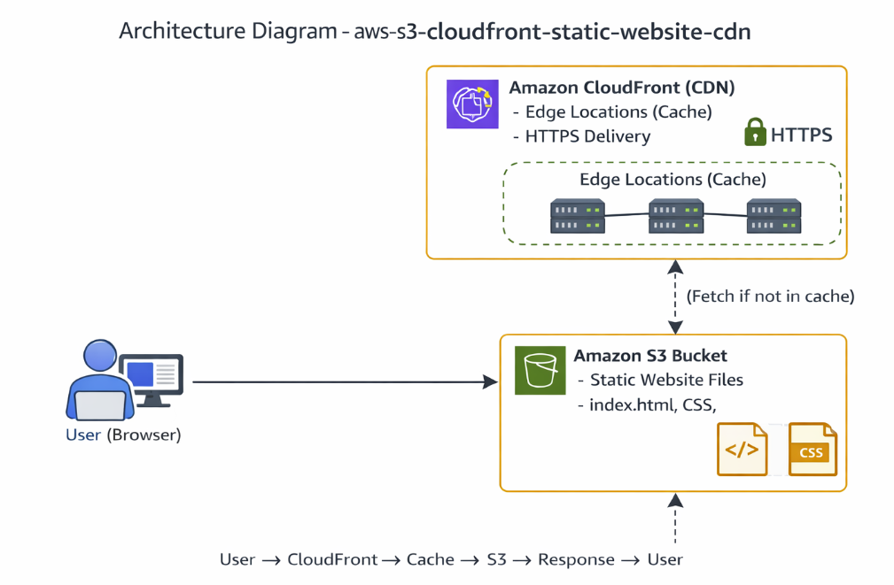
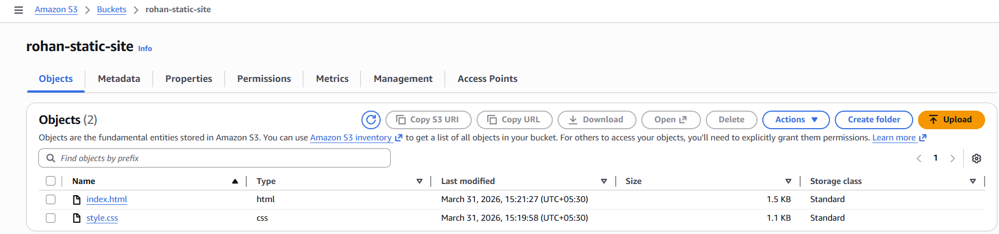
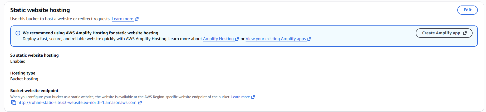
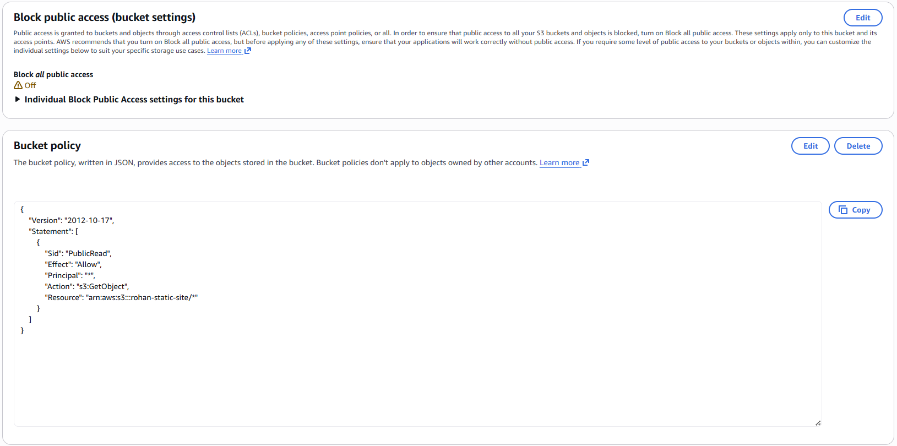
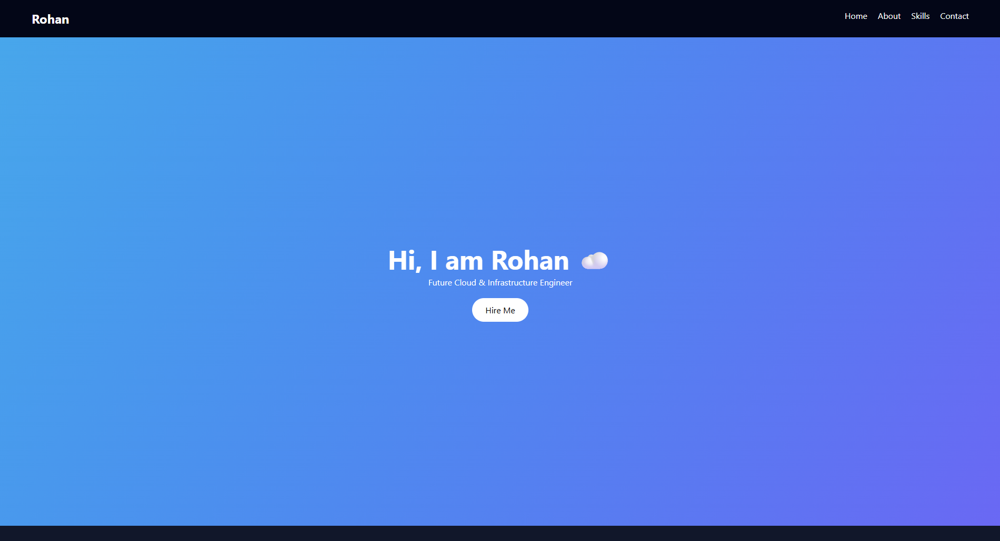
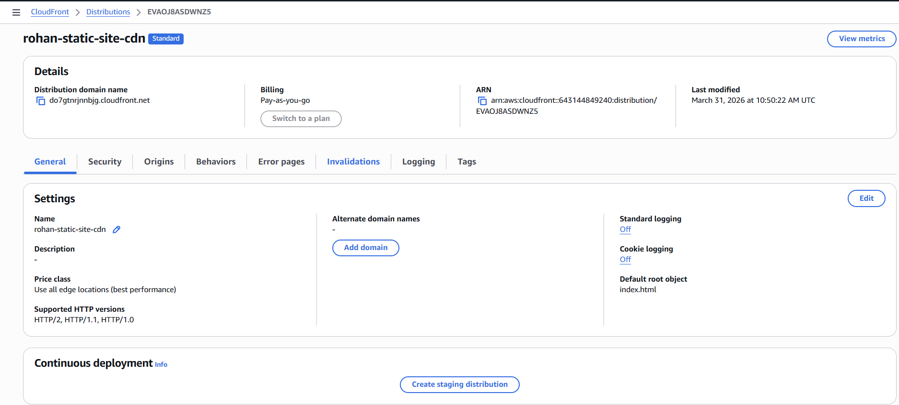
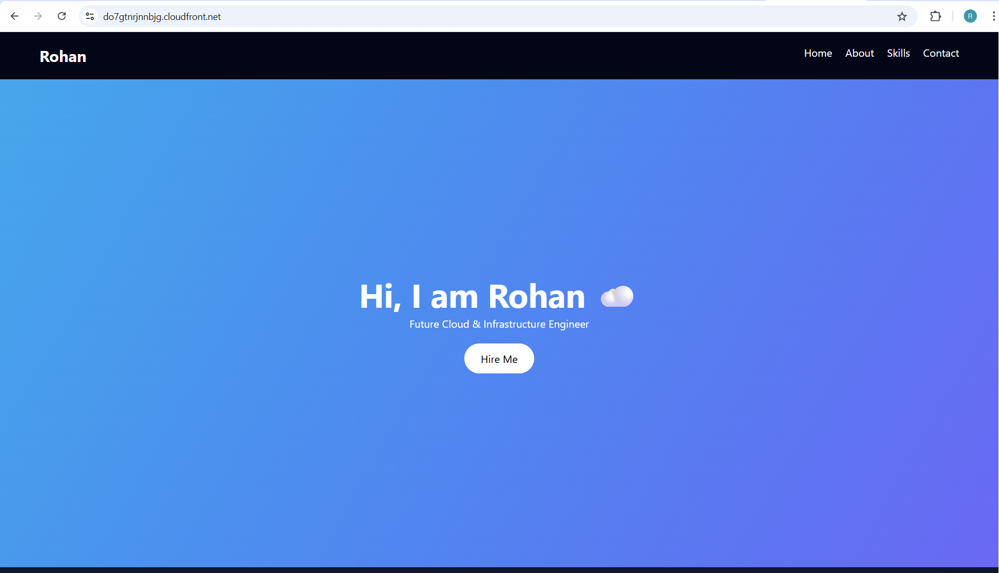

# Global-Static-Website-Hosting-using-S3-CloudFront-CDN

A production-ready static website hosting solution using **AWS S3** and **CloudFront** with **CDN** optimization and secure global delivery.

- **Project Objective :**

To design and implement a **scalable, secure, and high-performance** static website hosting solution using Amazon S3 and CloudFront CDN, ensuring **global content delivery** with optimized **latency** and **caching**.

- **Project Overwiew :**

This project demonstrates how to host a static website using Amazon S3 and **enhance** its performance and **security** using **Amazon CloudFront**. 

The website files are **stored** in an **S3 bucket** and **served globally** through **CloudFront edge locations**. 

The setup includes **static website hosting**, **secure access configuration**, **HTTPS enforcement**, and **cache optimization** using CDN mechanisms.

- **Services Used :**
  
  --Amazon S3
  
  --Amazon CloudFront
  
  --AWS IAM

- **Key Features :**

  --Static website hosting using S3
  
  --Global content delivery using CloudFront CDN
  
  --HTTPS secure access with automatic redirection
  
  --Improved performance through caching
  
  --Controlled access using Origin Access Control (OAC)
  
  --Cache invalidation for real-time content updates
  
  --Highly scalable and cost-effective architecture

- **Real-World Applications :**

  --Company landing pages
  
  --Portfolio websites
  
  --Documentation hosting
  
  --Marketing campaign pages
  
  --Static frontend for web applications
  
  --Content delivery for global users

- **Archiecture Diagram :**

The user accesses the website through CloudFront, which serves cached content from edge locations for faster performance. 
If the requested content is not cached, CloudFront retrieves it from the S3 bucket and delivers it to the user while caching it for future requests.

- **System Flow :**

1. User requests website using CloudFront URL
2. CloudFront checks if content is cached
3. If cached → serves directly (fast response)
4. If not cached → fetches from S3 bucket
5. Content is delivered to user and cached at edge location
6. Future requests are served faster from cache

- **Project Flow :** (IMPLEMENTATION FLOW)

1. Created S3 bucket for static website hosting
2. Uploaded website files (index.html)
3. Enabled static website hosting in S3
4. Configured bucket policy for public access
5. Verified website using S3 endpoint
6. Created CloudFront distribution
7. Connected S3 as origin
8. Enabled HTTPS redirection
9. Configured Origin Access Control (OAC)
10. Accessed website via CloudFront URL
11. Tested caching behavior
12. Performed cache invalidation

- **Pratical steps  :**

- **Step 1 :** **S3 SETUP + WEBSITE HOSTING**

  Created an **Amazon S3 bucket** with a globally **unique name** and configured it for **static website hosting**.
  
  Uploaded the website files **(index.html)** into the bucket.

  

  Enabled static website hosting from the **bucket properties** and defined **index.html** as the **default document**.

  

  Disabled the “**Block all public access**” setting to allow public access.

  Updated the **bucket policy** to **allow public read access (s3:GetObject)** for all objects inside the bucket to resolve access issues and make the **website publicly accessible**.

  

- **Step 2  :** **VERIFY S3 WEBSITE**

Accessed the **static website endpoint URL** generated by S3 from the **bucket properties** and verified that the **uploaded website content** is publicly accessible and **rendering correctly** in the browser without any **access errors**.

- **Step 3 :** **CLOUDFRONT SETUP (CDN + SECURITY)**

Created an **Amazon CloudFront distribution** and **configured the S3 bucket** as the **origin source**. 

Set the viewer protocol policy to redirect **HTTP requests to HTTPS** for **secure communication**. 

Enabled **Origin Access Control (OAC)** and **linked it with the S3 bucket** to **restrict direct public access** to the **bucket**. 

Updated the **S3 bucket policy automatically** through CloudFront to allow access **only via the distribution**. 

Initiated the **distribution deployment** and waited until the **status** changed to **deployed**.

- **Step 4 :** **ACCESS WEBSITE VIA CLOUDFRONT**

Accessed the website using the **CloudFront distribution** **domain name** and verified that the content is being served successfully through the **CDN with HTTPS enabled** and improved **loading performance** compared to the **direct S3 endpoint**.

